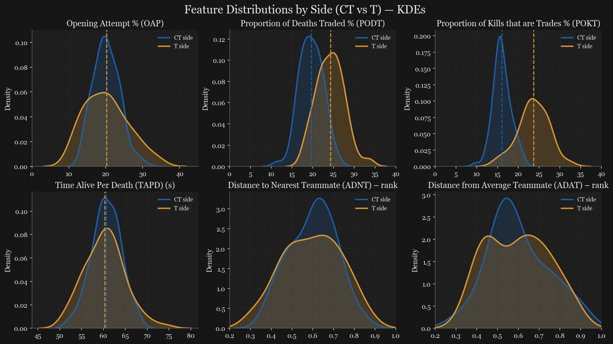
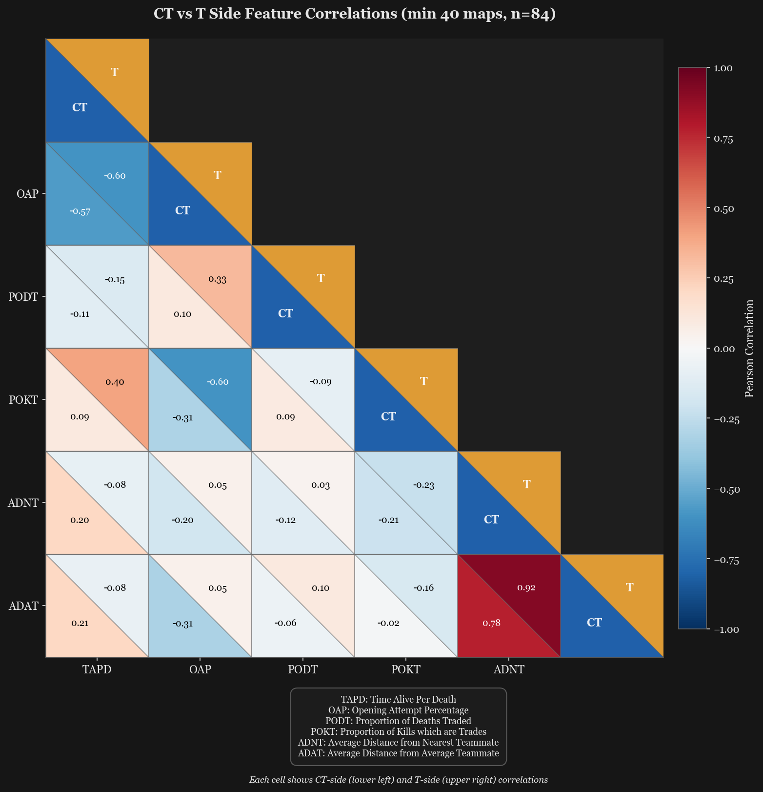

# CS2 Playstyle Analysis (2024)

**Quantitative analysis of professional Counter-Strike 2 player behaviour using match demo data.**

This project explores professional CS2 players' behavioural patterns through aggression, trading, and positioning metrics derived from 2024 international LAN matches. The analysis proceeds in three stages: exploratory characterisation of playstyle features across roles and sides, analysing natural clusters and whether they align with roles, and training classification models to assess whether the features alone can predict assigned roles.

---

## Dataset

The project uses my **[CS2 Playstyle Dataset (2024)](https://github.com/Jamie-Packer/cs2-playstyle-dataset-2024)**, a structured collection of player-level behavioural features aggregated from ~1,150 professional match demos. Features capture player tendencies without relying on outcome statistics, enabling pure behaviour-based analysis.

**Key metrics include:**
- **Aggression:** Time Alive Per Death (TAPD), Opening Attempt Percentage (OAP)
- **Trading:** Proportion of Deaths Traded (PODT), Proportion of Kills which were Trades (POKT)
- **Positioning:** Team-relative distance rankings (ADNT, ADAT)

Role labels are adapted from [Harry Richards' Positions Database](https://public.tableau.com/app/profile/harry.richards4213/viz/OLDPositionsDatabaseArchived/PositionsDatabaseNER0cs). Full feature definitions and methodology are documented in [`data/raw/DATASET_CARD.md`](data/raw/DATASET_CARD.md).

---

## Repository Structure
```
├── data/
│   ├── raw/                    # Original dataset and documentation
│   └── processed/              # Engineered features and refined datasets
├── notebooks/
│   └── 01_eda.ipynb           # Exploratory analysis and feature engineering
│   └── (WIP) More notebooks 
├── results/
│   └── eda/
│       ├── figures/           # Visualisations (PNG, SVG, HTML)
│       └── tables/            # Summary statistics and test results
├── src/                       # Reusable analysis and visualisation utilities
└── environment.yml            # Conda environment specification
```

---

## Key Findings (EDA)

**Data Stability:** Analysis establishes a 40-map minimum threshold per player, yielding a stable cohort of 84 professionals with reliable behavioural estimates.

**Side Differences:** T-side players exhibit significantly higher trading rates and more variable playstyles compared to CT-side, reflecting the tactical asymmetry between attacking and defending.

**Role Patterns:** Behavioural features show meaningful separation between roles, particularly on T-side where AWPers, Spacetakers, and Lurkers display distinct signatures. CT-side roles form less discrete clusters, consistent with the fluidity of defensive rotations.

**Positional Insights:** Distance to nearest teammate (ADNT) and distance from team centre (ADAT) are highly correlated but capture distinct role tendencies. Engineered residual features isolate peripheral vs central positioning independent of isolation effects.

### Sample Visualisations

**Side Comparison:** T-side players show markedly higher trading rates compared to CT-side.



**Feature Pearson Correlations:** Positioning metrics (ADNT/ADAT) are (unsuprisingly) strongly correlated, inciting further investigation.



---

## Installation

**Prerequisites:** [Conda](https://docs.conda.io/en/latest/miniconda.html) or [Mamba](https://mamba.readthedocs.io/)
```bash
# Clone the repository
git clone https://github.com/Jamie-Packer/cs2-playstyle-analysis-2024-public.git
cd cs2-playstyle-analysis-2024-public

# Create and activate environment
conda env create -f environment.yml
conda activate cs2-playstyle

# Launch Jupyter
jupyter notebook
```

Navigate to `notebooks/01_eda.ipynb` to reproduce the exploratory analysis.

---

## Notebooks

| Notebook | Description | Status |
|----------|-------------|--------|
| `01_eda.ipynb` | Exploratory analysis, hypothesis testing, feature engineering | ✅ Complete |
| `02_clustering.ipynb` | Unsupervised playstyle clustering | 🚧 WIP |
| `03_classification.ipynb` | Supervised role prediction | 🚧 WIP |

---

## Licence

**Code:** [MIT Licence](LICENSE) - analysis scripts and visualisation utilities  
**Data:** [CC BY 4.0](LICENSE-DATA) - CS2 Playstyle Dataset (2024)

When using this analysis or dataset, please cite:
- **Dataset:** Jamie Packer, [*CS2 Playstyle Dataset (2024)*](https://github.com/Jamie-Packer/cs2-playstyle-dataset-2024)
- **Role labels:** [Harry Richards' Positions Database](https://public.tableau.com/app/profile/harry.richards4213/viz/OLDPositionsDatabaseArchived/PositionsDatabaseNER0cs)

---

## Acknowledgements

- **Jamie Packer** (me!) for creating and publishing the CS2 Playstyle Dataset
- **Harry Richards** for the foundational role classification work
- The professional CS2 community for producing the match data that makes this analysis possible
